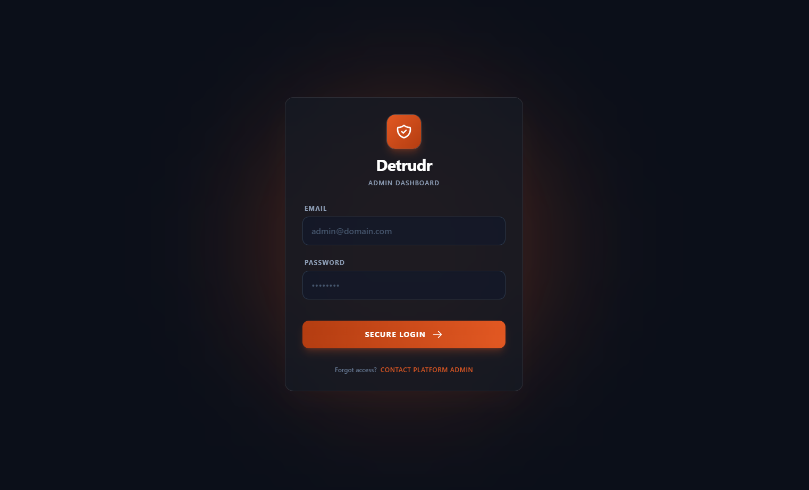
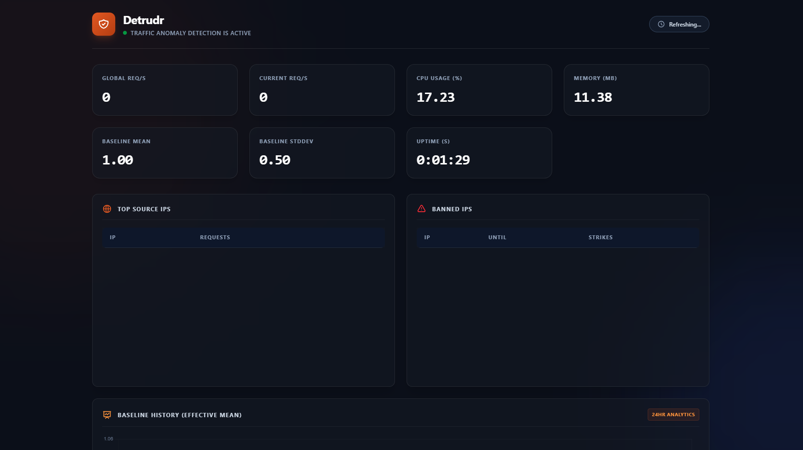
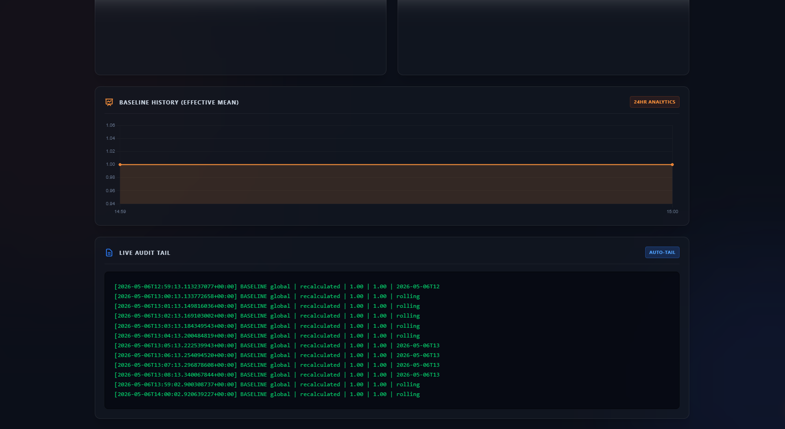

# Detrudr

[](https://github.com/Okpainmo/detrudr/actions/workflows/ci.yml)
[](LICENSE)
[](https://www.rust-lang.org/)
[](https://conventionalcommits.org)
[](CODE_OF_CONDUCT.md)

`detrudr` is a traffic-anomaly and DDoS counter engine.



It is a host-level security daemon that sits beside an nginx-fronted service, tails nginx JSON
access logs in real time, learns rolling request baselines, detects suspicious spikes, optionally
blocks abusive source IPs with `iptables`, writes a durable audit trail, sends Slack notifications,
and exposes a live dashboard for operators.



Detrudr is designed for teams and platform administrators who need a practical host-level traffic
guard without deploying a heavyweight observability stack. It favors clear operational behavior,
explicit configuration, safe defaults, and a deployment model that works naturally with systemd.

## Table Of Contents

- [What Detrudr Does](#what-detrudr-does)
- [Design](#design)
- [Architecture](#architecture)
- [How It Works](#how-it-works)
- [Repository Layout](#repository-layout)
- [Configuration](#configuration)
- [nginx Log Requirements](#nginx-log-requirements)
- [Deployment](#deployment)
- [Dashboard](#dashboard)
- [Audit Log](#audit-log)
- [Slack Notifications](#slack-notifications)
- [Security Model](#security-model)
- [Local Development](#local-development)
- [Operations Guide](#operations-guide)
- [Troubleshooting](#troubleshooting)
- [Roadmap](#roadmap)
- [Contributing](#contributing)
- [License](#license)

## What Detrudr Does

- Tails nginx JSON access logs from `log.path` or `LOG_PATH`.

- Parses `source_ip`, `timestamp`, `method`, `path`, `status`, and `response_size`.

- Maintains exact 60-second sliding windows for global traffic, per-IP traffic, and error rates.

- Recomputes rolling baselines from the most recent 30 minutes of per-second samples.

- Detects anomalies using z-score and rate-multiplier checks.

- Tightens per-IP thresholds when the IP's 4xx/5xx ratio surges.

- Blocks anomalous IPs with `iptables` when `DRY_RUN=false`.

- Unbans temporary bans on an escalating schedule.

- Preserves strike history for repeat offenders, with configurable decay to bound memory use.

- Sends Slack notifications for bans, unbans, and global anomaly alerts when enabled.

- Writes audit records in a stable format for incident review.

- Serves a password-protected dashboard and `/metrics` JSON endpoint.

## Design

- **Safe by default:** `dry_run` defaults to `true`, Slack defaults to disabled, and the dashboard
  binds to localhost by default.

- **Operationally explicit:** production firewall enforcement requires `DRY_RUN=false` and a systemd
  service that can manage host `iptables` rules.

- **Durable audit trail:** production audit records default to `/var/log/detrudr/audit.log`.

- **Low moving parts:** Detrudr is a single Rust daemon with no database dependency.

- **Real-time enough:** the dashboard refreshes every 3 seconds and the detector ticks every second.

- **Predictable under rotation:** log tailing detects replacement/truncation and reopens the file.

- **No blind trust in forwarded headers:** `X-Forwarded-For` is honored only from configured trusted
  reverse proxies.

## Architecture

Detrudr is built as one daemon with a small set of focused modules:

```text
nginx access log
      |
      v
monitor.rs  ->  engine.rs  ->  blocker.rs
                 |   |          |
                 |   |          +-- iptables DROP/DELETE rules
                 |   |
                 |   +------ notifier.rs -> Slack webhook
                 |
                 +---------- audit log
                 |
                 +---------- dashboard.rs -> HTML dashboard + /metrics
```

<!-- Architecture diagram slot:
Add a rendered diagram at docs/architecture.png and reference it here:

-->

<!-- Deployment diagram slot:
Add a host/systemd/nginx/firewall diagram here when available.
-->

## How It Works

### Sliding Window Design

Detrudr uses `VecDeque<DateTime<Utc>>` windows instead of coarse counters.

- `global_requests` stores request timestamps across all source IPs.

- `ip_requests` stores one timestamp deque per source IP.

- `global_errors` and `ip_errors` track 4xx/5xx responses separately.

- On each event and tick, timestamps older than the configured `window.seconds` are evicted from the
  front of each deque.

This gives an exact rolling request rate over the last 60 seconds by default, instead of relying on
bucketed per-minute counters that can hide spikes at bucket boundaries.

### Baseline Design



The baseline implementation lives in [src/baseline.rs](src/baseline.rs).

Default rules:

- History window: `1800` seconds, or 30 minutes.

- Recalculation interval: `60` seconds.

- Sample type: per-second request counts.

- Hour preference: the current hour is preferred once it has enough samples.

- Rolling fallback: if the current hour does not have enough samples, recent samples are merged
  across hour boundaries and labeled as `rolling`.

- Stale bucket pruning: hour buckets that fall outside the history window are removed.

- Floor values prevent divide-by-zero behavior and over-sensitive startup detection.

Default baseline floors:

```yaml
baseline:
  floor_mean: 1.0
  floor_stddev: 0.5

thresholds:
  error_floor_mean: 0.05
  error_floor_stddev: 0.01
```

### Detection Logic

The main detector lives in [src/engine.rs](src/engine.rs).

Per-IP detection:

- Compute current request rate from the IP's 60-second window.

- Compare the current rate against that IP's learned baseline.

- Trigger a ban if either condition is true:
  - z-score is greater than `thresholds.zscore`

  - current rate is greater than `thresholds.rate_multiplier * baseline_mean`

Global detection:

- Compute global request rate from the global 60-second window.

- Compare it against the global baseline.

- Emit a Slack/audit alert when anomalous.

- Global alerts do not block IPs.

Error surge handling:

- Detrudr tracks each IP's 4xx/5xx ratio.

- If the ratio exceeds the learned error baseline by `thresholds.error_multiplier`, per-IP
  thresholds are tightened with `thresholds.tightening_factor`.

- This helps catch noisy scanners faster without making all traffic permanently more sensitive.

### Blocking And Unbanning

Blocking uses `iptables` through [src/blocker.rs](src/blocker.rs).

When an IP is banned, Detrudr inserts a DROP rule:

```bash
iptables -I INPUT -s <ip> -j DROP
```

When a temporary ban expires, Detrudr checks whether the rule still exists and deletes it only if
present:

```bash
iptables -C INPUT -s <ip> -j DROP
iptables -D INPUT -s <ip> -j DROP
```

Missing rules during unban are treated as no-op success, which makes manual firewall cleanup safe.

Actual `iptables` execution errors are treated as failures and do not remove in-memory ban state.

Default ban schedule:

1. First strike: `10 minutes`

2. Second strike: `30 minutes`

3. Third strike: `2 hours`

4. Fourth strike onward: permanent

Strike history decays after `blocking.strike_decay_hours` so the strike map does not grow forever
from one-off attackers.

## Repository Layout(Key Components)

```text
.
├── bin/                         # Versioned pre-built binaries for releases
├── src/
│   ├── main.rs                  # Startup, config loading, dashboard/tick loop wiring
│   ├── config.rs                # YAML + .env loading and runtime overrides
│   ├── monitor.rs               # nginx JSON log parser and rotation-aware tailer
│   ├── baseline.rs              # Rolling baseline calculation
│   ├── engine.rs                # Detection, audit, snapshots, ban lifecycle
│   ├── blocker.rs               # iptables wrapper
│   ├── notifier.rs              # Slack webhook notifier
│   └── dashboard/
│       ├── dashboard.rs         # Embedded dashboard server and auth
│       ├── pages/
│       └── public/
├── config.yaml                  # Static runtime configuration
├── .env.sample                  # Runtime secrets and deployment overrides
├── Dockerfile                   # Container image for systemd-managed Docker deployments
├── Cargo.toml
├── SECURITY.md
├── CONTRIBUTING.md
├── CODE_OF_CONDUCT.md
└── LICENSE
```

## Configuration

Static settings live in [config.yaml](config.yaml). Deployment-specific values and secrets live in
`.env`.

### Default Config

```yaml
app:
  log_level: INFO

log:
  path: /var/log/nginx/detrudr-stream.log

window:
  seconds: 60

baseline:
  history_seconds: 1800
  recalc_interval_seconds: 60
  min_samples_per_hour: 300
  floor_mean: 1.0
  floor_stddev: 0.5

thresholds:
  zscore: 3.0
  rate_multiplier: 5.0
  tightening_factor: 1.5
  error_multiplier: 3.0
  error_floor_mean: 0.05
  error_floor_stddev: 0.01
  global_alert_cooldown_seconds: 60

blocking:
  dry_run: true
  iptables_chain: INPUT
  ban_minutes:
    - 10
    - 30
  ban_hours_final: 2
  strike_decay_hours: 24

slack:
  enabled: false
  webhook_url: ""
  channel: ""

dashboard:
  host: 127.0.0.1
  port: 8090
  trusted_proxies:
    - 127.0.0.1
    - ::1

audit:
  path: /var/log/detrudr/audit.log
```

### Environment Variables

Copy [.env.sample](.env.sample) to `.env` and set deployment-specific values:

```env
WEB_HOOK_URL='https://hooks.slack.com/services/...'

CHANNEL='#channel-name'

ENABLE_SLACK_NOTIFICATION=false

LOG_PATH='/var/log/nginx/detrudr-stream.log'

AUDIT_LOG_PATH='/var/log/detrudr/audit.log' # production

# AUDIT_LOG_PATH='/tmp/detrudr-audit.log' # local development

EMAIL='auth-email'

PASSWORD='auth-password'

DRY_RUN=true
```

Supported overrides:

| Environment variable        | Overrides           | Notes                                                                       |
| --------------------------- | ------------------- | --------------------------------------------------------------------------- |
| `LOG_PATH`                  | `log.path`          | Path to nginx JSON access log.                                              |
| `AUDIT_LOG_PATH`            | `audit.path`        | Use `/tmp/...` for local dev and `/var/log/detrudr/...` in production.      |
| `WEB_HOOK_URL`              | `slack.webhook_url` | Slack incoming webhook URL.                                                 |
| `CHANNEL`                   | `slack.channel`     | Slack channel name.                                                         |
| `ENABLE_SLACK_NOTIFICATION` | `slack.enabled`     | Boolean: `true`, `false`, `1`, `0`, `yes`, `no`, `on`, `off`.               |
| `DRY_RUN`                   | `blocking.dry_run`  | `true` disables blocking; `false` enforces `iptables` rules(real blocking). |
| `EMAIL`                     | dashboard auth      | Required.                                                                   |
| `PASSWORD`                  | dashboard auth      | Required.                                                                   |

### Important Settings

`blocking.dry_run`

- `true`: detection, audit, dashboard, and Slack behavior run, but no firewall rules are changed.

- `false`: Detrudr executes `iptables` block/unblock commands.

`blocking.strike_decay_hours`

- Bounds strike-tracking memory.

- Keeps escalation for repeat offenders within the decay window.

- Set to `0` to retain strike history for the process lifetime(I.e. to disable automatic forgetting
  of past strikes).

`dashboard.trusted_proxies`

- Controls whether `X-Forwarded-For` is trusted for dashboard login rate limiting.

- If the request does not come from a trusted proxy IP, Detrudr ignores `X-Forwarded-For` and uses
  the socket peer address.

> `trusted_proxies` is mainly for the dashboard login protection, not the main DDoS/anomaly blocking
> engine.
>
> For the dashboard/admin login:
>
> If 5 failed login attempts are made within 60 seconds, that login IP will get locked out for 30
> seconds. Successful login clears that IP’s failed-attempt history.
>
> This is separate from the main Detrudr traffic detection/blocking engine. It only protects the
> dashboard auth page.

## Nginx Log Requirements

Detrudr expects nginx JSON access logs with these fields:

- `source_ip`

- `timestamp`

- `method`

- `path`

- `status`

- `response_size`

Recommended log path:

```text
/var/log/nginx/detrudr-stream.log
```

Recommended nginx log format:

```nginx
log_format detrudr_json escape=json
'{'
  '"source_ip":"$remote_addr",'
  '"timestamp":"$time_iso8601",'
  '"method":"$request_method",'
  '"path":"$request_uri",'
  '"status":$status,'
  '"response_size":$body_bytes_sent'
'}';

access_log /var/log/nginx/detrudr-stream.log detrudr_json;
```

If nginx reverse-proxies traffic to the protected application, preserve client forwarding
headers(recommended):

```nginx
proxy_set_header X-Real-IP $remote_addr;
proxy_set_header X-Forwarded-For $proxy_add_x_forwarded_for;
proxy_set_header X-Forwarded-Proto $scheme;
```

If nginx reverse-proxies the Detrudr dashboard, keep `dashboard.host: 127.0.0.1` so the dashboard is
not exposed directly. For the recommended same-server setup, keep `127.0.0.1` and `::1` in
`dashboard.trusted_proxies`.

## Deployment

> IMPORTANT: This guide assumes that you have strong system administration skills, and have already
> put in place a standard nginx setup. See [Nginx Log Requirements](#nginx-log-requirements) above
> on how to configure nginx to output json logs.
>
> For a more thorough and beginner friendly production deployment guide, read this article where I
> practically walked through
> **[deploying detrudr to a sample real-life production environment](https://okpainmo.com/posts/deploying-detrudr-to-a-sample-real-life-production-environment)**.

For production environments, systemd-managed deployments are recommended. This gives Detrudr
predictable startup, restarts, logging, Linux capabilities, and audit-directory behavior.

### Host Preparation

1. Perform system updates.

```bash
sudo apt update
```

2. For `iptables`, check and install if unavailable:

```bash
command -v iptables
```

If missing:

```bash
sudo apt install -y iptables
```

3. The service examples below assume the existing system user and group are both `ubuntu`.

If your server uses another system user, replace `ubuntu` with that user and group throughout the
service examples.

For Docker deployments, the `ubuntu` user must be allowed to run Docker:

```bash
sudo usermod -aG docker ubuntu
```

For binary deployments, the `ubuntu` user must be able to read nginx logs. On many Debian/Ubuntu
systems, this means:

```bash
sudo usermod -aG adm ubuntu
```

### Option A: Systemd-Managed Docker-Based Deployment

For Docker deployment, we recommend that you run Detrudr as a system service.

Container-based deployments are useful when you prefer image-based rollouts, but real firewall
enforcement, meaning IP blocking and unblocking, must be tested on the target host because
`iptables` behavior from containers can vary by runtime, privileges, network mode, capabilities, and
kernel setup.

1. Prepare image.

- Pull from Docker hub:

```bash
docker pull okpainmo/detrudr:0.1.0
```

- Or build from source if you cloned this repository to your server:

```bash
docker build -t detrudr:<tag-name> .
```

2. Create your config and environment files, then customize as required.

```bash
# Create the config and log directories
sudo install -d -m 0750 -o root -g ubuntu /etc/detrudr
sudo install -d -m 0750 -o ubuntu -g ubuntu /var/log/detrudr

# Copy in the config and environment files
sudo install -m 0640 -o root -g ubuntu config.yaml /etc/detrudr/config.yaml
sudo install -m 0640 -o root -g ubuntu .env.sample /etc/detrudr/secrets.env

# Edit the config file
sudo nano /etc/detrudr/config.yaml

# Edit the secrets file
sudo nano /etc/detrudr/secrets.env
```

For production enforcement, set:

```env
AUDIT_LOG_PATH='/var/log/detrudr/audit.log'
DRY_RUN=false
```

At minimum, set a strong `EMAIL` and `PASSWORD` in `/etc/detrudr/secrets.env`. For the recommended
same-server nginx setup, keep `LOG_PATH='/var/log/nginx/detrudr-stream.log'`.

3. Create a system service for the container process.

```bash
sudo nano /etc/systemd/system/detrudr-container.service
```

The service file below assumes these defaults:

| Item                  | Assumed value              |
| --------------------- | -------------------------- |
| Systemd service user  | `ubuntu`                   |
| Systemd service group | `ubuntu`                   |
| Docker socket group   | `docker`                   |
| Docker image          | `okpainmo/detrudr:0.1.0`   |
| Config path           | `/etc/detrudr/config.yaml` |
| Environment file      | `/etc/detrudr/secrets.env` |
| Nginx log directory   | `/var/log/nginx`           |
| Audit log directory   | `/var/log/detrudr`         |
| Network mode          | host networking            |
| Firewall capability   | `NET_ADMIN`                |

```ini
[Unit]
Description=Detrudr Docker Container
After=docker.service
Requires=docker.service

[Service]
User=ubuntu
Group=ubuntu
SupplementaryGroups=docker
Restart=always
RestartSec=5
TimeoutStartSec=0

ExecStartPre=-/usr/bin/docker rm -f detrudr
ExecStart=/usr/bin/docker run --name detrudr \
  --network host \
  --cap-drop ALL \
  --cap-add NET_ADMIN \
  --security-opt no-new-privileges \
  --env-file /etc/detrudr/secrets.env \
  --mount type=bind,src=/etc/detrudr/config.yaml,dst=/app/config.yaml,readonly \
  --mount type=bind,src=/var/log/nginx,dst=/var/log/nginx,readonly \
  --mount type=bind,src=/var/log/detrudr,dst=/var/log/detrudr \
  okpainmo/detrudr:0.1.0
ExecStop=/usr/bin/docker stop detrudr
ExecStopPost=-/usr/bin/docker rm -f detrudr

[Install]
WantedBy=multi-user.target
```

Start it:

```bash
sudo systemctl daemon-reload
sudo systemctl enable --now detrudr-container
sudo systemctl status detrudr-container
```

For Docker pre-production checks, inside `/etc/detrudr/secrets.env` keep:

```env
DRY_RUN=true
```

This systemd service runs the Docker command as `ubuntu:ubuntu`. The container itself uses the
non-root user defined in the image. Switch to `DRY_RUN=false` only after confirming the container
can successfully add and delete test `iptables` rules on the target host.

### Option B: Systemd With Pre-Built Binary

1. Clone this repository and access it's root in your local environment:

```bash
git clone https://github.com/Okpainmo/detrudr.git
cd detrudr
```

Release binaries are provided in this repository with versioned names(see `./bin`). For example:

```text
detrudr_v0.1.0-linux-x86_64
```

2. Copy in the Detrudr binary, config, and environment file.

- Binary:

Perform a `local -> remote` ssh copy from the root of this repository:

```bash
scp bin/<preferred-detrudr-binary> <user>@<your-server-ip>:/tmp/detrudr
```

E.g.

```bash
scp bin/detrudr_v0.1.0-linux-x86_64 ubuntu@16.16.192.149:/tmp/detrudr
```

Then, on the server:

```bash
sudo install -m 0755 /tmp/detrudr /usr/local/bin/detrudr
```

- Config:

```bash
scp config.yaml <user>@<your-server-ip>:/tmp/config.yaml
```

E.g.

```bash
scp config.yaml ubuntu@16.16.192.149:/tmp/config.yaml
```

- Environment file:

```bash
scp .env.sample <user>@<your-server-ip>:/tmp/secrets.env
```

E.g.

```bash
scp .env.sample ubuntu@16.16.192.149:/tmp/secrets.env
```

Then, on the server:

```bash
# Create the config and log directories
sudo install -d -m 0750 -o root -g ubuntu /etc/detrudr
sudo install -d -m 0750 -o ubuntu -g ubuntu /var/log/detrudr

# Copy in the config and environment files
sudo install -m 0640 -o root -g ubuntu /tmp/config.yaml /etc/detrudr/config.yaml
sudo install -m 0640 -o root -g ubuntu /tmp/secrets.env /etc/detrudr/secrets.env

# Edit the config file
sudo nano /etc/detrudr/config.yaml

# Edit the secrets file
sudo nano /etc/detrudr/secrets.env
```

For production enforcement, set:

```env
AUDIT_LOG_PATH='/var/log/detrudr/audit.log'
DRY_RUN=false
```

3. Finally, create a system service to manage the Detrudr process.

The service file below assumes these defaults:

| Item                | Assumed value              |
| ------------------- | -------------------------- |
| Service user        | `ubuntu`                   |
| Service group       | `ubuntu`                   |
| Binary path         | `/usr/local/bin/detrudr`   |
| Config path         | `/etc/detrudr/config.yaml` |
| Environment file    | `/etc/detrudr/secrets.env` |
| Nginx log directory | `/var/log/nginx`           |
| Audit log directory | `/var/log/detrudr`         |
| Firewall capability | `CAP_NET_ADMIN`            |

```bash
sudo nano /etc/systemd/system/detrudr.service
```

```ini
[Unit]
Description=Detrudr Daemon
Documentation=https://github.com/Okpainmo/detrudr
After=network-online.target nginx.service
Wants=network-online.target

[Service]
Type=simple
User=ubuntu
Group=ubuntu
WorkingDirectory=/etc/detrudr
ExecStart=/usr/local/bin/detrudr --config /etc/detrudr/config.yaml
Restart=on-failure
RestartSec=5

EnvironmentFile=/etc/detrudr/secrets.env

AmbientCapabilities=CAP_NET_ADMIN
CapabilityBoundingSet=CAP_NET_ADMIN
NoNewPrivileges=true
LogsDirectory=detrudr

ProtectSystem=strict
ProtectHome=true
ReadWritePaths=/var/log/detrudr
ReadOnlyPaths=/etc/detrudr
ReadOnlyPaths=/var/log/nginx

[Install]
WantedBy=multi-user.target
```

This service runs as the non-root `ubuntu` user and grants only `CAP_NET_ADMIN` for firewall
operations. Keep `ProtectSystem=strict`, `ProtectHome=true`, and the read/write path restrictions in
place to reduce the service's filesystem access.

Start the service and view it's status:

```bash
sudo systemctl daemon-reload
sudo systemctl enable --now detrudr
sudo systemctl status detrudr
```

## Dashboard

Default dashboard config:

```yaml
dashboard:
  host: 127.0.0.1
  port: 8090
```

The dashboard is intentionally local-only by default. Put nginx in front of it if you need HTTPS or
external access.

Dashboard views include:

- global request rate

- current-second request count

- CPU usage

- memory usage

- effective baseline mean/stddev

- top source IPs

- banned IPs

- recent audit entries

- baseline history chart

Machine-readable metrics are available at:

```text
GET /metrics
```

Unauthenticated `/metrics` requests return `401` JSON so dashboard clients can return to login
cleanly when a session expires.

## Audit Log

Production default:

```text
/var/log/detrudr/audit.log
```

Local development override:

```env
AUDIT_LOG_PATH='/tmp/detrudr-audit.log'
```

Audit format:

```text
[timestamp] ACTION ip | condition | rate | baseline | duration
```

Example:

```text
[2026-04-29T07:36:39.766020+00:00] BASELINE global | recalculated | 1.00 | 1.00 | rolling
[2026-04-29T07:45:10.100000+00:00] BAN 198.51.100.10 | ip_rate | 7.20 | 1.10 | 10m
[2026-04-29T07:55:10.200000+00:00] UNBAN 198.51.100.10 | ip_rate | 0.00 | 1.30 | 10m
```

Follow audit logs on a binary deployment:

```bash
sudo tail -f /var/log/detrudr/audit.log
```

Follow audit logs on a Docker deployment:

```bash
sudo tail -f /var/log/detrudr/audit.log
```

## Slack Notifications

Slack notifications are disabled by default.

Enable them in `.env`:

```env
ENABLE_SLACK_NOTIFICATION=true
WEB_HOOK_URL='your-web-hook-url'
CHANNEL='#preferred-slack-channel'
```

When Slack is disabled, Detrudr logs a short notification summary instead of dumping the full Slack
payload. This avoids retaining IP addresses and strike details in application logs just because
Slack delivery is off.

## Security Model

Detrudr has a small but security-sensitive runtime surface:

- It reads nginx access logs.

- It writes audit records.

- It serves an authenticated dashboard.

- It can mutate host firewall rules when enforcement is enabled.

Recommended security posture:

- Run the systemd services as the assumed non-root `ubuntu` user, or replace `ubuntu` with your
  chosen system user.

- Grant only the firewall capability needed for enforcement.

- Keep `ProtectSystem=strict`, `ProtectHome=true`, and narrow `ReadWritePaths`/`ReadOnlyPaths`.

- Keep `dashboard.host: 127.0.0.1` unless a reverse proxy and network policy are in place.

- Configure `dashboard.trusted_proxies` when using a reverse proxy.

- Keep `DRY_RUN=true` in development and staging until thresholds are validated.

- Use `/var/log/detrudr/audit.log` in production.

- Use strong dashboard credentials in `.env`.

The dashboard session token is generated from `/dev/urandom`. If secure token generation fails,
Detrudr refuses to create the session instead of issuing a predictable token.

## Local Development

1. Clone and access the project repository.

```bash
git clone https://github.com/Okpainmo/detrudr.git
cd detrudr
```

2. Ensure Rust is installed then installed all required dependencies.

```bash
cargo build
```

3. Create a local environment file:

```bash
cp .env.sample .env
```

For local development, use:

```env
AUDIT_LOG_PATH='/tmp/detrudr-audit.log'
DRY_RUN=true
# others as needed
```

4. Run:

```bash
cargo dev
```

See `.cargo/config.toml` to see the use of the `dev` as an alias for
`watch -c -w src -x 'run -- --config config.yaml'`.

The daemon tails `LOG_PATH`, so make sure that path exists and receives JSON nginx log lines. If you
only want to exercise parsing and tests, use `cargo test`.

Format and validate:

```bash
cargo fmt --check
cargo test
```

## Operations Guide

### Logs

Application logs:

```bash
sudo journalctl -u detrudr -f
```

Container service logs:

```bash
sudo journalctl -u detrudr-container -f
```

Audit trail:

```bash
sudo tail -f /var/log/detrudr/audit.log
```

### Validate Firewall Enforcement

You may wish to keep `DRY_RUN=true` until detection thresholds look reasonable in audit/dashboard
output.

When ready:

```env
DRY_RUN=false
```

Restart the service:

```bash
sudo systemctl restart detrudr
```

Inspect current rules:

```bash
sudo iptables -S INPUT
```

### Log Rotation

Detrudr detects nginx log replacement and truncation. Standard `logrotate` setups are supported.
After rotation, the tailer reopens the path and continues reading the fresh file.

## Troubleshooting

### `Permission denied` or `Read-only file system` for audit log

Local development should use:

```env
AUDIT_LOG_PATH='/tmp/detrudr-audit.log'
```

Production systemd deployments should include:

```ini
LogsDirectory=detrudr
ReadWritePaths=/var/log/detrudr
```

### `iptables` commands fail

Check that:

- `DRY_RUN=false`.

- Binary deployments include `AmbientCapabilities=CAP_NET_ADMIN` and
  `CapabilityBoundingSet=CAP_NET_ADMIN`.

- `iptables` is installed.

- `blocking.iptables_chain` exists.

- Docker deployments include `--cap-add NET_ADMIN` and host networking.

### Dashboard login rate limiting seems wrong behind nginx

Check `dashboard.trusted_proxies`. Detrudr only trusts `X-Forwarded-For` when the immediate peer is
in that list.

### Dashboard is unreachable

By default Detrudr binds to:

```yaml
dashboard:
  host: 127.0.0.1
  port: 8090
```

Use a local browser, SSH tunnel, or nginx reverse proxy. Avoid binding directly to `0.0.0.0` unless
you have an explicit network/security plan.

### No bans are happening

Check:

- `DRY_RUN` value.

- Detection thresholds.

- Whether nginx logs contain valid `source_ip` and `status` fields.

- Whether traffic is sufficient to exceed the learned baseline.

- Audit log entries for `GLOBAL_ALERT`, `BAN`, and `BASELINE`.

## Contributing

Contributions are welcome. Please read:

- [CONTRIBUTING.md](CONTRIBUTING.md)
- [CODE_OF_CONDUCT.md](CODE_OF_CONDUCT.md)
- [SECURITY.md](SECURITY.md)

This project follows Conventional Commits.

## License

Detrudr is licensed under the [MIT License](LICENSE).
